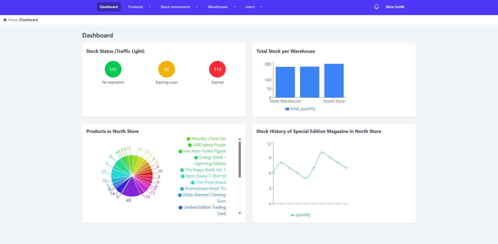

# Tabulae

A full-stack inventory management platform built with FastAPI, React, and PostgreSQL — featuring JWT authentication, role-based access control, real-time WebSocket updates, and a fully Dockerized deployment.

     



## Table of Contents

- [About the Project](#about-the-project)
- [Main Features](#main-features)
- [Technical Highlights](#technical-highlights)
- [Tech Stack](#tech-stack)
- [Project Structure](#project-structure)
- [Getting Started](#getting-started)
  - [Requirements](#requirements)
  - [Setup with Docker](#setup-with-docker)
  - [Running Locally (Optional)](#running-locally-optional)
- [Environment Variables](#environment-variables)
- [Testing](#testing)
- [Deployment](#deployment)
- [Versioning](#versioning)
- [Documentation](#documentation)
- [Contributing](#contributing)
- [License](#license)
- [Author](#author)

---

## About the Project

**Tabulae** is a full-stack inventory management platform developed as the final project of a three-year web development program — and as a personal deep dive into full-stack development.

Built from scratch, Tabulae features a clear separation between frontend and backend, both containerized and orchestrated with Docker. The backend exposes a secure REST API using FastAPI and SQLModel, while the frontend is a responsive Single Page Application built with React and Tailwind CSS.

It includes JWT authentication, role-based access, CSV exports, and real-time WebSocket notifications — all structured with scalability and modularity in mind.

The name _Tabulae_ comes from Latin — meaning boards, records, or tablets — a nod to both ancient inventories and modern databases. Inventory systems are a great domain for full-stack projects: they touch every layer of an application — auth, relational data, business logic, real-time updates, and data visualization — which made them the perfect challenge to build from the ground up.

---

## Main Features

- **User authentication and roles**  
  Register, login, logout, refresh tokens, and password verification. Role-based access control for admin and regular users.

- **Product management**  
  Create, edit, delete, and list products. Filter by category or active status. Batch actions and CSV export supported.

- **Warehouse management**  
  Manage warehouses with detailed stock views, history tracking, and graphical dashboards. Support for activating/deactivating warehouses.

- **Stock movements**  
  Create and track incoming/outgoing stock movements with multiple lines, linked to lots and expiration dates.

- **Lot and expiration control**  
  Products can be tracked by lot and expiration date. Visual dashboards highlight expiring stock and stock health.

- **Real-time updates via WebSocket**  
  Notifications triggered on stock movement creation, with plans to expand WebSocket integration in future versions.

- **Interactive dashboards**  
  Charts and summaries for stock levels, movement types, warehouse detail, and expiration stats using Recharts.

- **Stock tracking by category, product, warehouse, or time**  
  Explore current stock or historical data with multiple filters and endpoints for time series or pie charts.

- **Category management**  
  Products are organized by categories, which can be created, edited, or deleted via the admin interface.

- **Responsive and modern UI**  
  Clean design using React, Tailwind CSS, and React Router. SPA architecture with protected routes for each user type.

- **Fully Dockerized setup**  
  Easy to run with Docker Compose. Includes backend, frontend, and PostgreSQL container orchestration.

---

## Technical Highlights

- **Layered backend architecture** — Clear separation between models (SQLModel), schemas (Pydantic), and routers (FastAPI), with shared `Depends()` injection for auth, sessions, and permissions.
- **JWT access + refresh token flow** — Short-lived access tokens paired with refresh tokens, with role-based guards (`require_admin`) applied at the dependency layer.
- **Isolated test database** — Pytest uses a dedicated PostgreSQL container (port 5433) with per-test session cleanup, ensuring fully isolated and reproducible tests.
- **Paginated responses** — All list endpoints return a consistent `{ data, total, limit, offset }` shape, ready for frontend pagination.
- **Real-time WebSocket notifications** — Stock movement events broadcast to connected clients via a WebSocket endpoint.
- **Docker Compose orchestration** — Separate dev (hot reload, pgAdmin) and production (Nginx + Gunicorn) configurations with independent Dockerfiles per service.

---

## Tech Stack

### Backend

- **FastAPI** — Python web framework for building RESTful APIs
- **SQLModel** + **SQLAlchemy** — ORM and models for database access
- **PostgreSQL** — Relational database for data persistence
- **Pydantic v2** — Data validation and serialization
- **JWT (PyJWT)** — Authentication with access and refresh tokens
- **WebSockets** — Real-time notifications for stock movements
- **Uvicorn** + **Gunicorn** — ASGI servers for development and production
- **Python-Dotenv** — Environment configuration management

### Frontend

- **React 19** — UI library for building a Single Page Application (SPA)
- **Vite** — Frontend tooling for fast development and build
- **Tailwind CSS** — Utility-first CSS framework for styling
- **React Router v7** — Client-side routing
- **Context API** — State management (auth, user context)
- **Recharts** — Data visualization (stock, expiration, warehouse charts)
- **React Select** — Async dropdowns for product and warehouse selection
- **PapaParse** — CSV export functionality
- **JWT-Decode** — Decode and read JWTs on the client side

### Dev Tools & Config

- **Docker** + **Docker Compose** — Containerized full-stack environment
- **Nginx** — Serves the frontend in production and handles SPA routing
- **ESLint** — Linting and code quality for frontend
- **Vite Plugin React** — Enhanced DX for React + Vite
- **Pytest** + **pytest-asyncio** — Backend testing framework

---

## Project Structure

The project uses a monorepo layout with Dockerized services. Here's a high-level overview:

```bash
.
├── backend/                  # FastAPI backend application
│   └── app/                  # Routers, models, database logic
├── frontend/                 # React SPA with Vite and Tailwind CSS
│   └── src/                  # Frontend source code
├── db_init/                  # SQL scripts to initialize and seed the database
├── docs/                     # Extended documentation
│   └── images/               # Screenshots and assets
├── docker-compose.yml        # Docker Compose (production)
├── docker-compose.dev.yml    # Docker Compose (development)
├── .env.template             # Example env file used to generate the final .env
├── .gitignore
├── LICENSE
├── CONTRIBUTING.md
└── README.md

```

Each service (backend and frontend) includes its own Dockerfiles and configuration files. The .env.template file at the root serves as a base to configure environment variables.

---

## Getting Started

This section explains how to set up and run the application using Docker. You can also run the frontend and backend separately during development if needed.

### Requirements

- [Docker](https://www.docker.com/) and [Docker Compose](https://docs.docker.com/compose/) installed
- Optionally:
  - [Python 3.11+](https://www.python.org/) (for backend local development)
  - [Node.js](https://nodejs.org/) + [npm](https://www.npmjs.com/) (for frontend local development)

### Setup with Docker

1. **Clone the repository**

```bash
git clone https://github.com/duquediazn/tabulae.git
cd tabulae
```

2. **Create your environment file from the template**

```bash
cp .env.template .env
```

3. **Run the app using Docker Compose**

```bash
docker compose up --build
```

This uses docker-compose.yml and starts:

- backend: FastAPI app
- frontend: React + Nginx static build
- db: PostgreSQL container

Once running:

- Frontend: http://localhost:5173
- Backend (API): http://localhost:8000
- API Docs: http://localhost:8000/docs

**Development mode (optional)**

```bash
docker compose -f docker-compose.dev.yml up --build
```

This will start:

- backend (live reload)
- frontend (Vite dev server)
- db (PostgreSQL)
- pgadmin (GUI for PostgreSQL at http://localhost:5050)

> 🔑 Login credentials for pgAdmin and PostgreSQL can be set in your .env.

### Running Locally (Optional)

You can also run the frontend and backend separately for development:

**Backend only**

```bash
cd backend
python -m venv .venv  # Create a virtual environment
source .venv/bin/activate
# On Windows: .venv\Scripts\activate
pip install -r requirements.txt
cp .env.template .env
uvicorn app.main:app --reload
```

Make sure PostgreSQL is running and the DATABASE_URL in .env is valid.

**Frontend only**

```bash
cd frontend
npm install
npm run dev
```

> ⚙️ For advanced configuration and troubleshooting, see [docs/SETUP.md](./docs/SETUP.md)

#### 🐧 Note for Linux users (permissions)

If you're developing on Linux and encounter a permissions error when running npm install in the frontend/ directory, it's likely caused by files created by Docker using the root user.

To fix it, simply run the following command once from the root of the project:

```bash
sudo chown -R $(id -u):$(id -g) frontend/
```

This will restore file ownership to your current user and allow you to run commands like npm install or edit files without issues.

This step is usually not required on macOS or Windows thanks to Docker Desktop's permission handling.

---

## Environment Variables

The project uses a unified `.env` file at the root to configure services.

To get started:

```bash
cp .env.template .env
```

This file includes essential configuration such as:

- Runtime environment mode (`development` / `production`)
- PostgreSQL credentials
- JWT secret and token durations
- pgAdmin login
- API URL for the frontend (injected during build or runtime)

> ⚙️ See [docs/SETUP.md](./docs/SETUP.md#environment-variables) for detailed variable usage.

---

## Testing

The backend includes a suite of automated tests written with [pytest](https://docs.pytest.org/).

You can run them using the dedicated test database service defined in `docker-compose.dev.yml`.

### Run tests

Make sure the test database is running:

```bash
docker compose -f docker-compose.dev.yml --profile test up -d db_test
```

Then, inside the backend container or locally:

```bash
cd backend
pytest
```

> 🔎 The test database runs on port `5433` to avoid conflicts with the main DB.

### Test structure

Tests are located in the `backend/tests/` directory and organized by feature:

- `test_users.py`: user creation, roles, permissions
- `test_auth.py`: login, tokens, password verification
- `test_products.py`: product CRUD and validation
- `test_warehouses.py`: warehouse operations
- `test_stock.py`: stock queries, categories, expirations
- `test_stock_movements.py`: movement creation, lines, summaries

---

## Deployment

The project is designed to be deployed as a unified Dockerized stack using `docker-compose.yml`.

### Local or server deployment

To deploy the full application stack (frontend, backend, and PostgreSQL):

```bash
docker compose up --build
```

The frontend is built with Vite and served by Nginx, while the backend runs under Gunicorn.

> ⚙️ See [Production Setup](./docs/SETUP.md#production-setup) for details on services, ports, volumes, and environment configuration.

### Future improvements

The project is structured to support future deployment strategies, including:

- Deployment to a VPS (e.g. with Docker Compose and Nginx reverse proxy)
- CI/CD automation using GitHub Actions
- Integration with monitoring or logging tools

> These enhancements are part of the [project roadmap](./docs/ROADMAP.md).

---

## Versioning

This project follows [Semantic Versioning](https://semver.org/) (MAJOR.MINOR.PATCH) and uses Git Flow for branch management.

- Development happens on the `develop` branch.
- Stable versions are tagged on `main` using annotated Git tags.
- Each version represents a stable milestone of the application.

Current version: `v1.0.0`

> 🏷️ See [docs/VERSIONS.md](./docs/VERSIONS.md) for version history and changelog.

---

## Documentation

The following documents provide more detail about using, installing, and evolving Tabulae:

- [How to Use the App](./docs/USAGE.md) — Overview of the UI and main flows
- [Setup Guide](./docs/SETUP.md) — Detailed installation & local dev workflow
- [Version History](./docs/VERSIONS.md) — Release notes and SemVer tags
- [Roadmap](./docs/ROADMAP.md) — Planned improvements and ideas

---

## Contributing

Feedback, bug reports, and forks are welcome. If you spot something that could be improved or find an issue, feel free to open an issue or submit a pull request.

> See [CONTRIBUTING.md](./CONTRIBUTING.md) for branch conventions, commit guidelines, and PR workflow.

---

## License

This project is licensed under the GNU General Public License v3.0.

> See the [LICENSE](./LICENSE) file for full details.

---

## Author

Tabulae was designed and developed by [@duquediazn](https://github.com/duquediazn) — a web developer with a focus on full-stack applications, clean architecture, and practical tooling. This project represents months of learning, problem-solving, and hands-on exploration across the entire stack.
