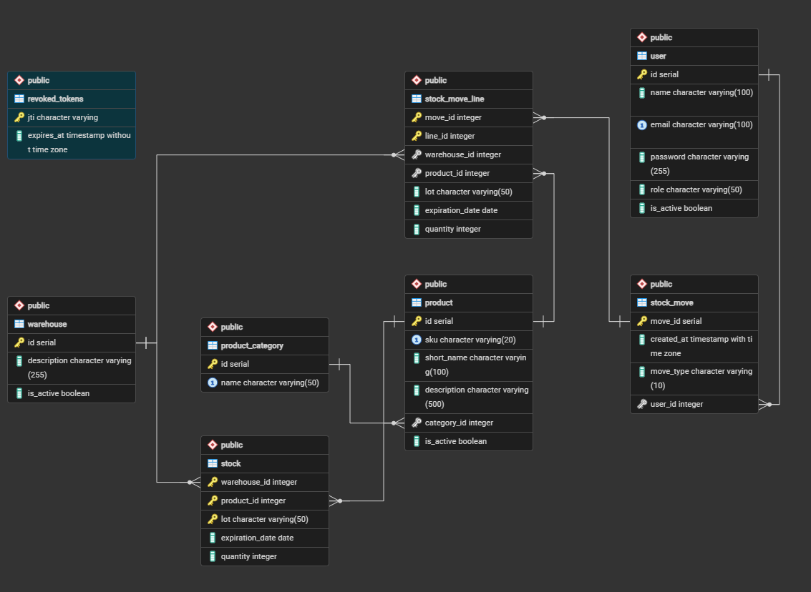

# Architecture

This document describes the internal structure of Tabulae: how the system is organized, how components communicate, and how key flows (authentication, data access, real-time updates) are implemented.

---

## Table of Contents

- [System Overview](#system-overview)
- [Container Layout](#container-layout)
- [Backend Architecture](#backend-architecture)
  - [Layer Structure](#layer-structure)
  - [Routers](#routers)
  - [Authentication & Authorization](#authentication--authorization)
  - [WebSocket](#websocket)
- [Data Model](#data-model)
- [Frontend Architecture](#frontend-architecture)
  - [Routing and Route Guards](#routing-and-route-guards)
  - [Auth State](#auth-state)
  - [API Layer](#api-layer)
- [Request Lifecycle](#request-lifecycle)
- [Authentication Flow](#authentication-flow)

---

## System Overview

Tabulae is a three-tier application:

```
Browser (React SPA)
       │  HTTP/WebSocket
       ▼
  FastAPI backend
       │  SQL (SQLAlchemy)
       ▼
   PostgreSQL 17
```

All three tiers run as Docker containers orchestrated by Docker Compose. The frontend is either served by Vite (development) or compiled as static files behind Nginx (production).

---

## Container Layout

### Development (`docker-compose.dev.yml`)

| Service    | Image / Build        | Port    | Notes                              |
| ---------- | -------------------- | ------- | ---------------------------------- |
| `db`       | `postgres:17`        | `5432`  | Persistent volume `pgdata_dev`     |
| `backend`  | `./backend` (dev)    | `8000`  | Uvicorn with `--reload`            |
| `frontend` | `./frontend` (dev)   | `5173`  | Vite dev server, hot reload        |
| `pgadmin`  | `dpage/pgadmin4`     | `5050`  | Optional DB GUI                    |
| `db_test`  | `postgres:17`        | `5433`  | Isolated test DB (`--profile test`)|

### Production (`docker-compose.yml`)

| Service    | Image / Build     | Port   | Notes                           |
| ---------- | ----------------- | ------ | ------------------------------- |
| `db`       | `postgres:17`     | `5432` | Persistent volume `pgdata`      |
| `backend`  | `./backend`       | `8000` | Gunicorn multi-worker           |
| `frontend` | `./frontend`      | `8080` | Static build served by Nginx    |

All services share a Docker bridge network (`tabulae-network`) for internal communication. The frontend never contacts the database directly.

---

## Backend Architecture

The backend is a **FastAPI 0.121** application located in `backend/app/`. It follows a strict layered structure.

### Layer Structure

```
backend/app/
├── main.py              # App entry point: lifespan, CORS, router registration
├── dependencies.py      # Shared FastAPI Depends (require_admin)
├── models/              # SQLModel ORM table definitions
│   └── database.py      # Engine creation, get_db() session dependency
├── schemas/             # Pydantic request/response schemas
├── routers/             # Route handlers (one file per resource)
└── utils/
    ├── authentication.py  # JWT creation/decoding, bcrypt hashing
    ├── getenv.py          # Required env var loader
    └── validation.py      # Shared validation helpers
```

Data flows strictly downward: **routers → dependencies / schemas → models**. Routers never import from other routers, except `auth.py` which exposes `get_current_user` as a reusable dependency.

### Routers

Each resource has its own `APIRouter` with a fixed prefix and tag:

| Router file              | Prefix               | Auth required      |
| ------------------------ | -------------------- | ------------------ |
| `auth.py`                | `/auth`              | Partially (public login/register) |
| `users.py`               | `/users`             | `require_admin`    |
| `products.py`            | `/products`          | Read: any user; Write: `require_admin` |
| `product_categories.py`  | `/categories`        | Read: any user; Write: `require_admin` |
| `warehouses.py`          | `/warehouses`        | Read: any user; Write: `require_admin` |
| `stock.py`               | `/stock`             | `get_current_user` |
| `stock_moves.py`         | `/stock-moves`       | `get_current_user` |
| `websocket.py`           | `/ws`                | Token validated on first message (see [WebSocket](#websocket)) |

Paginated list endpoints return a consistent shape:

```json
{
  "data": [...],
  "total": 42,
  "limit": 10,
  "offset": 0
}
```

### Authentication & Authorization

Authentication uses **JWT** (PyJWT, HS256). Two token types are in play:

- **Access token** — short-lived (default 30 min), returned in the JSON response body and stored in memory by the frontend.
- **Refresh token** — long-lived (default 7 days), stored in an **HttpOnly cookie** (`refresh_token`). The cookie is set with `secure=True` when `ENVIRONMENT=production`.

Authorization is enforced through two FastAPI dependencies:

- `get_current_user` — decodes the access token from the `Authorization: Bearer` header, checks the `revoked_tokens` blocklist (see below), and returns the `User` ORM object. Used for routes any authenticated user can access.
- `require_admin` (in `dependencies.py`) — calls `get_current_user` and additionally checks `user.role == "admin"`. Raises `HTTP 403` otherwise.

Role checks are never inlined inside route functions; they are always delegated to these dependencies.

**Token revocation:** every JWT includes a `jti` (JWT ID) claim — a UUID generated at creation time. On logout, the `jti` of the access token is stored in the `revoked_tokens` table alongside its expiration time. `get_current_user` rejects any token whose `jti` appears in this table, making logout effectively immediate regardless of token lifetime.

### WebSocket

A single WebSocket endpoint is registered at `/ws/stock-moves`. It uses a `ConnectionManager` class that maintains a list of **authenticated** active connections and broadcasts text messages to all of them.

**Authentication flow:** connections are authenticated via a first-message pattern. The client connects and immediately sends the access token as the first text message. The server validates the token (signature, expiry, and `is_active` status) before adding the connection to the broadcast list. Connections that fail validation are closed with code `1008` (Policy Violation). This avoids exposing the token as a URL query parameter, which would appear in server logs.

When a stock movement is created via the REST API, the `stock_moves` router broadcasts a notification through this manager, so connected clients can update their UI without polling.

---

## Data Model

Seven tables make up the schema. The diagram below shows the foreign key relationships:



| Table               | Primary key                           | Key columns                                         |
| ------------------- | ------------------------------------- | --------------------------------------------------- |
| `user`              | `id`                                  | `email`, `role` (`admin`/`user`), `is_active`       |
| `warehouse`         | `id`                                  | `description`, `is_active`                          |
| `product_category`  | `id`                                  | `name` (unique)                                     |
| `product`           | `id`                                  | `sku` (unique), `category_id` FK, `is_active`       |
| `stock`             | (`warehouse_id`, `product_id`, `lot`) | `quantity`, `expiration_date`                       |
| `stock_move`        | `move_id`                             | `move_type` (`IN`/`OUT`), `user_id` FK, `created_at`|
| `stock_move_line`   | (`move_id`, `line_id`)                | `warehouse_id`, `product_id`, `lot`, `quantity`     |
| `revoked_tokens`    | `jti`                                 | `expires_at` — used to invalidate tokens on logout  |

The schema is created at application startup by SQLModel's `create_db_and_tables()`. SQL init scripts in `db_init/` run once on first PostgreSQL volume creation and seed the initial data and database triggers.

---

## Frontend Architecture

The frontend is a **React 19 SPA** located in `frontend/src/`. It uses React Router v7 for navigation, Tailwind CSS v4 for styling, and Recharts for data visualizations.

```
frontend/src/
├── main.jsx          # Entry point: renders App inside BrowserRouter + AuthProvider
├── App.jsx           # Root component: mounts AppRouter
├── api/              # All backend API calls (one file per resource)
│   └── config.js     # Reads VITE_API_URL; throws if not defined
├── context/
│   ├── AuthProvider.jsx  # Auth state, token refresh logic, login/logout
│   └── useAuth.js        # Custom hook to consume AuthContext
├── components/       # Reusable UI components
├── hooks/
│   └── useWebSocket.js   # WebSocket connection hook
├── pages/            # One component per route/page
├── router/
│   ├── AppRouter.jsx     # Declares all routes
│   ├── PrivateRoute.jsx  # Redirects to /login if not authenticated
│   ├── PublicRoute.jsx   # Redirects to /dashboard if already authenticated
│   └── AdminRoute.jsx    # Redirects to /dashboard if not admin
└── utils/            # Shared frontend utilities
```

### Routing and Route Guards

Routes are organized into three protection levels:

| Guard          | Condition to pass                   | On failure           |
| -------------- | ----------------------------------- | -------------------- |
| `PublicRoute`  | User is **not** authenticated       | Redirect `/dashboard`|
| `PrivateRoute` | User **is** authenticated           | Redirect `/login`    |
| `AdminRoute`   | User is authenticated **and** admin | Redirect `/dashboard`|

### Auth State

`AuthProvider` wraps the entire application and exposes its state through the `useAuth()` hook. It manages:

- `accessToken` — held in memory (never in `localStorage`).
- `user` — decoded user object (name, email, role).
- `isLoading` — prevents render flicker while session is being verified on page load.

On mount, `AuthProvider` attempts to silently refresh the access token by calling `POST /auth/refresh`. If the HttpOnly cookie containing the refresh token is valid, the user is restored without a login prompt. Token refresh is also scheduled automatically 5 minutes before the access token expires.

### API Layer

All calls to the backend live in `src/api/`. Components never construct URLs directly. Every file imports `API_URL` from `src/api/config.js`, which reads `import.meta.env.VITE_API_URL` and throws at startup if it is undefined.

---

## Request Lifecycle

A typical authenticated API request follows this path:

```
Page/Component
  └─ calls function in src/api/<resource>.js
        └─ fetch(API_URL + "/endpoint", { headers: { Authorization: "Bearer <token>" } })
              └─ FastAPI router function
                    ├─ Depends(get_current_user) → decodes JWT, fetches User from DB
                    ├─ Depends(require_admin)    → checks role (admin-only routes)
                    ├─ Depends(get_db)           → opens SQLModel Session
                    └─ try/except SQLAlchemyError → wraps all DB queries
```

---

## Authentication Flow

```
1. User submits credentials → POST /auth/login
2. Backend verifies password (bcrypt), issues:
     - access_token  (JWT, 30 min)  → returned in JSON body
     - refresh_token (JWT, 7 days)  → set as HttpOnly cookie
3. Frontend stores access_token in memory (AuthProvider state).
4. Every request includes: Authorization: Bearer <access_token>
5. 5 minutes before expiry, AuthProvider calls POST /auth/refresh:
     - Browser automatically sends the HttpOnly cookie
     - Backend validates refresh token, issues new access_token
6. On logout → POST /auth/logout:
     - Clears the HttpOnly refresh token cookie server-side.
     - Stores the access token's `jti` in `revoked_tokens` (with its expiration time).
     - Subsequent requests using the same access token are rejected immediately by `get_current_user`.
```

The refresh token is never accessible to JavaScript (`HttpOnly`). In production (`ENVIRONMENT=production`), both tokens' cookies are set with `Secure=True`, requiring HTTPS.
