# How to Use Tabulae

This guide walks through the main user-facing features of the Tabulae inventory management application.

## Table of Contents

- [Sign In and Register](#sign-in-and-register)
  - [Login](#login)
  - [Register](#register)
- [Dashboard](#dashboard)
  - [Navigation](#navigation)
  - [Stock Status (Traffic Light)](#stock-status-traffic-light)
  - [Total Stock per Warehouse](#total-stock-per-warehouse)
  - [Product Distribution (Pie Chart)](#product-distribution-pie-chart)
  - [Stock History (Line Chart)](#stock-history-line-chart)
- [Products](#products)
  - [Stock by Category (Overview)](#stock-by-category-overview)
  - [Products in Selected Category](#products-in-selected-category)
  - [Quick Access](#quick-access)
  - [Product List](#product-list)
  - [Creating a Product](#creating-a-product)
- [Categories & Product Details](#categories--product-details)
  - [Manage Categories (Admin Only)](#manage-categories-admin-only)
  - [Expiring Stock](#expiring-stock)
  - [Product Actions from List](#product-actions-from-list)
  - [Edit Product](#edit-product)
  - [Product Stock Summary](#product-stock-summary)
  - [Stock History by Warehouse](#stock-history-by-warehouse)
  - [Full Product History](#full-product-history)
- [Stock Movements](#stock-movements)
  - [Overview and Quick Access](#overview-and-quick-access)
  - [New Stock Movement](#new-stock-movement)
  - [Stock Movements List](#stock-movements-list)
  - [Movement Detail](#-movement-detail)
- [Warehouses](#warehouses)
  - [Overview and Quick Actions](#overview-and-quick-actions)
  - [Product History in a Warehouse](#product-history-in-a-warehouse)
  - [Manage Warehouses](#manage-warehouses)
  - [Create New Warehouse](#create-new-warehouse)
  - [Warehouses List](#warehouses-list)
  - [Warehouse Detail & Stock](#warehouse-detail--stock)
  - [Edit Warehouse](#edit-warehouse)
  - [Stock per Warehouse](#stock-per-warehouse)
- [Users (Admin)](#users-admin)
  - [Users List](#users-list)
  - [Create User](#create-user)
  - [Edit User](#edit-user)
- [User Profile and Notifications](#user-profile-and-notifications)
  - [Access and Options](#access-and-options)
  - [Profile View](#profile-view)
  - [Edit Profile](#edit-profile)
  - [Real-time Notifications (WebSocket)](#real-time-notifications-websocket)

---

## Sign In and Register

To start using Tabulae, users must log in with their credentials or create an account if they don't have one.  

### Login

From the login screen, enter your email and password to access the platform.  
If the credentials are valid and your user is active, you will be redirected to the dashboard.

- If the email or password is incorrect, an error message will be shown.
- If your user is inactive, you will not be able to sign in until an admin activates your account.

**Default demo users** (created automatically when running the app with Docker):

| Name           | Email               | Password       | Role   | Status   |
|----------------|---------------------|----------------|--------|----------|
| Alice Smith    | alice@example.com   | alice_example  | Admin  | Active   |
| Bob Johnson    | bob@example.com     | bob_example    | User   | Active   |
| Charlie Lee    | charlie@example.com | charlie_example| User   | Inactive |

> You can use these accounts for testing.

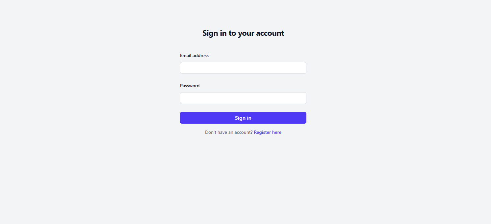

---

### Register

Click on “Register here” from the login page to create a new account.  
You’ll be asked to provide:

- Full name  
- Email address  
- Password (8 characters minimum)

Once submitted, a confirmation message will appear.

> **Note:** Newly registered users are inactive by default.  
> An admin must activate the account before you can sign in.

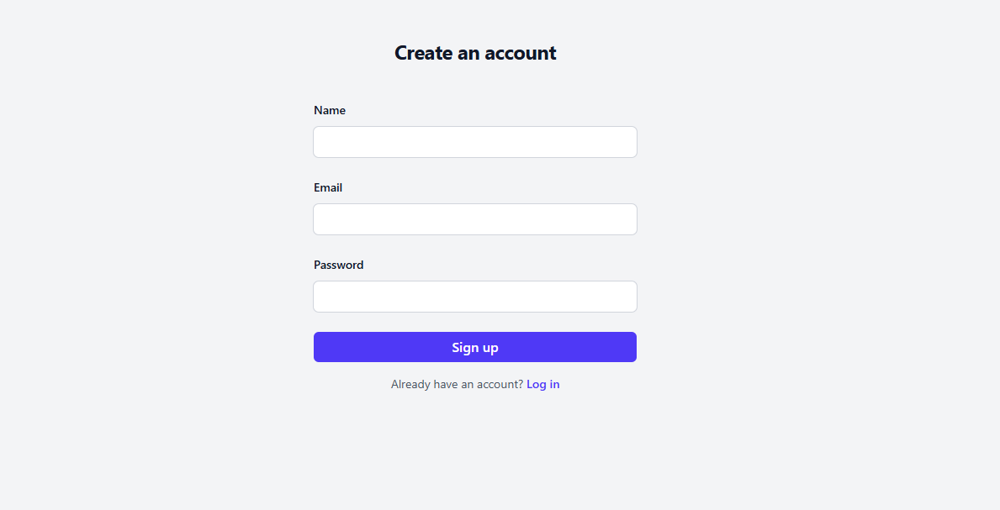

## Dashboard

After logging in, you’ll land on the dashboard — the main overview of your stock and warehouse activity.

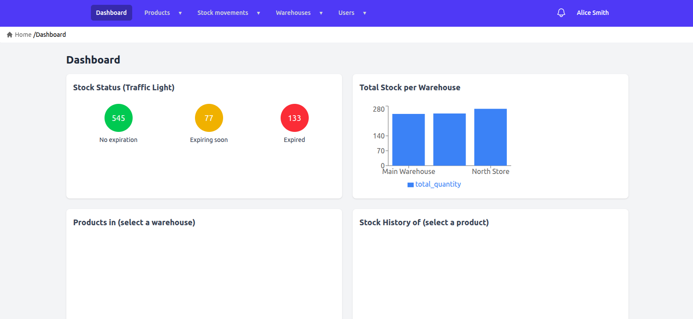

---

### Navigation

- A **breadcrumb trail** appears below the navbar, helping you track where you are and navigate back.
- Use the **navigation menu** at the top to switch between products, warehouses, movements, etc.

---

### Stock Status (Traffic Light)

This section uses colored circles to summarize product expiration states:

- 🟢 **No expiration**: Products without an expiration date or with an expiration date more than six months from today.
- 🟡 **Expiring soon**: Products that expire between one and six months from today.
- 🔴 **Expiring now**: Products that expire within the next 30 days (≤ 1 month).

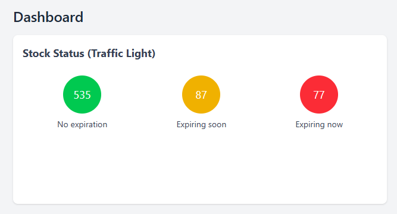

Clicking on the yellow or red indicators will take you to the list of products expiring within those time frames.

---

### Total Stock per Warehouse

A bar chart displays the total quantity of items per warehouse.

- Click on any bar to drill down into the product distribution within that warehouse.

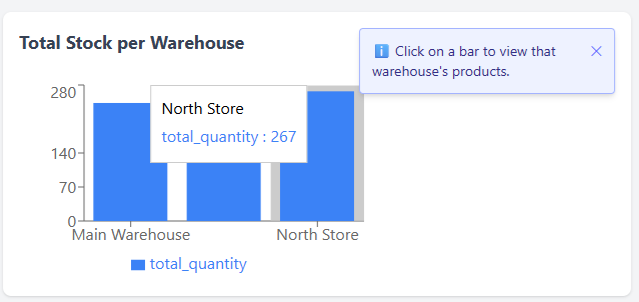

---

### Product Distribution (Pie Chart)

Once a warehouse is selected, a pie chart shows the stock breakdown by product in that warehouse.

- Hover to see values.
- Click on a product to load its historical stock evolution.

---

### Stock History (Line Chart)

Selecting a product reveals a line chart displaying its stock over time in the selected warehouse.

- This chart is calculated based on incoming and outgoing movements.
- Helps visualize how stock levels changed.

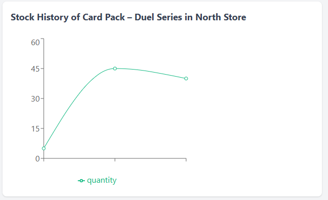

---

> Hover over charts to discover interactive messages and hints.

## Products

The **Products** section allows you to explore, manage, and analyze your inventory items. You’ll find visual summaries, detailed tables, and options to create or update products.

---

### Stock by Category (Overview)

The initial view shows a pie chart summarizing total stock by product category.

- **Click a category** to see its product breakdown.
- Useful for spotting category imbalances or focus areas.

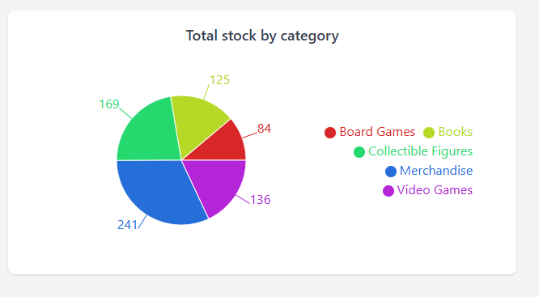

---

### Products in Selected Category

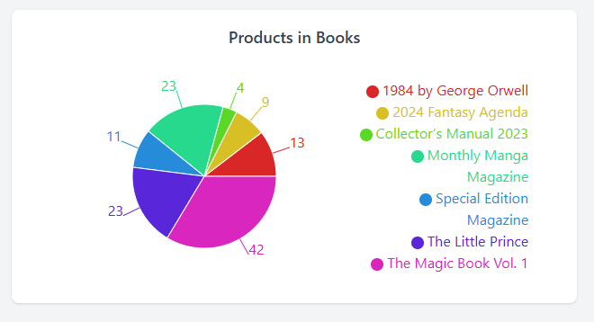

When a category is selected, a second chart shows the distribution of products within that category.

- **Click a product** to go to its detail page.

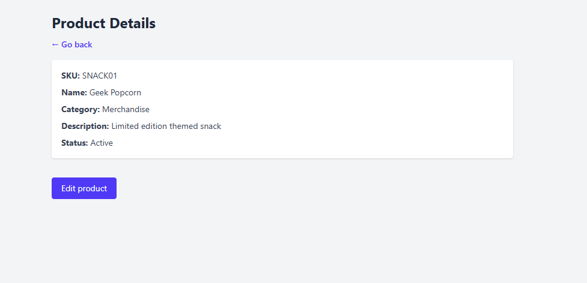

---

### Quick Access

At the top of the Products page, you’ll find quick links for:

- ➕ **Create product** (admin only)
- 📋 **View product list**
- 🧪 **By expiration** – navigate to the expiring stock filter view

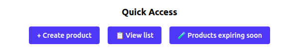

---

### Product List

In the product list, you can:

- Search by name or SKU
- Filter by category or active/inactive status
- Select multiple products and **activate/deactivate** them in bulk (admin only)
- Export the current filtered list to CSV
- Create new products (admin only)

Each row shows basic info and lets you:

- View details
- See current stock
- Edit or delete (admin only)

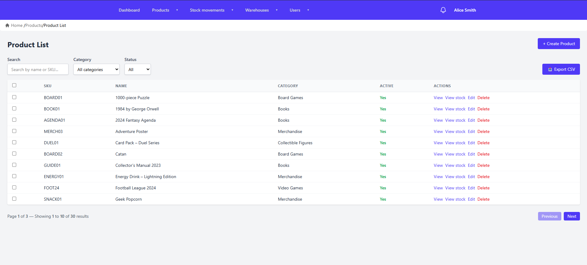

---

### Creating a Product

Admins can create products from the form at `/products/new`, entering:

- SKU (unique code)
- Name
- Description (optional)
- Category (select or create inline)

If the desired category doesn't exist, you can add it directly from the form.

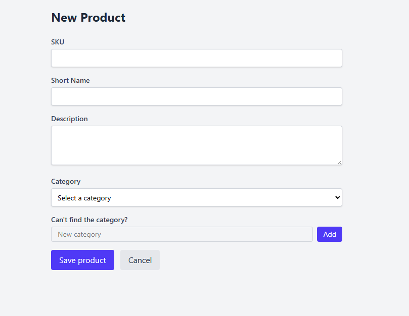

---

> 💡 Tip: All products must belong to a category and use capital letters/numbers for SKUs.

## Categories & Product Details

---

### Manage Categories (Admin Only)

Admins can manage product categories by visiting the “Manage Categories” view from the **Products** dropdown menu.

In this section you can:

- **Create** new categories
- **Edit** existing ones
- **Delete** categories (if not in use)

Each name must be between 3 and 50 characters.

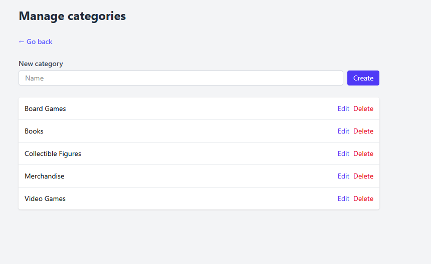

---

### Expiring Stock

From the **Products** menu or the **dashboard traffic light**, you can access a dedicated view of expiring products.

This table displays:

- Product name and SKU  
- Warehouse and lot  
- Expiration date  
- Quantity available  
- Actions to view stock history or create an outgoing movement directly

You can filter this view by time range using the dashboard controls.

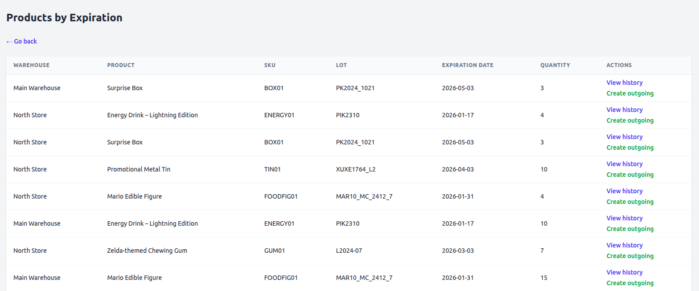

---

### Product Actions from List

From the product list, you have quick access to:

- **View** → See product details  
- **View stock** → See stock summary across warehouses  
- **Edit** (admin only) → Update name, description, category, or status  
- **Delete** (admin only) → Remove the product if allowed  

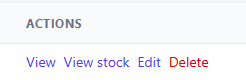

---

### Edit Product

The edit form allows you to:

- Modify SKU, name, description, or category  
- Add a new category inline if needed  
- Activate or deactivate the product  
- Delete it permanently (if allowed)

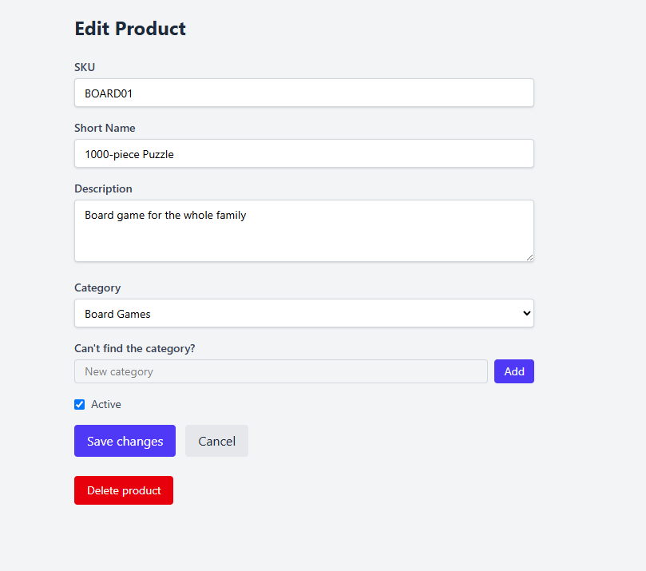

---

### Product Stock Summary

Clicking **View stock** opens a summary showing the product’s distribution across warehouses.

- See stock per warehouse and total  
- Click “View warehouse history” for details  
- Or “View total history” for the full product lifecycle

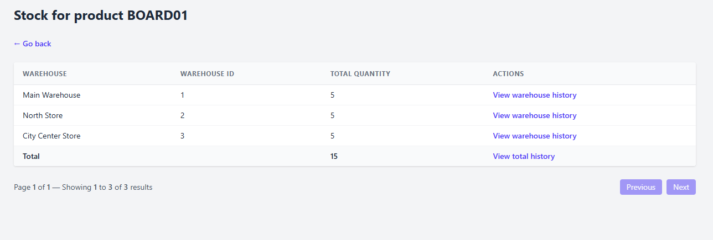

---

### Stock History by Warehouse

Shows how the product’s quantity changed over time in one specific warehouse.

- Includes a **line chart** of stock evolution  
- And a **table of movements** with type, date, lot, and user

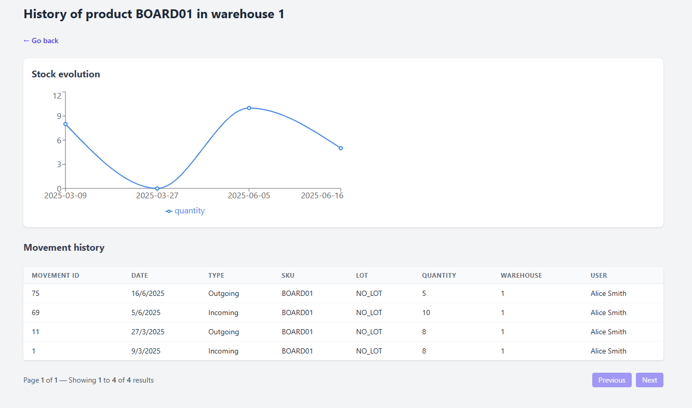

---

### Full Product History

The complete historical view shows all stock changes for the product, across all warehouses.

- Line chart to visualize changes  
- Table of all movements (incoming/outgoing)

Ideal for audits, incident analysis, or inventory trends.

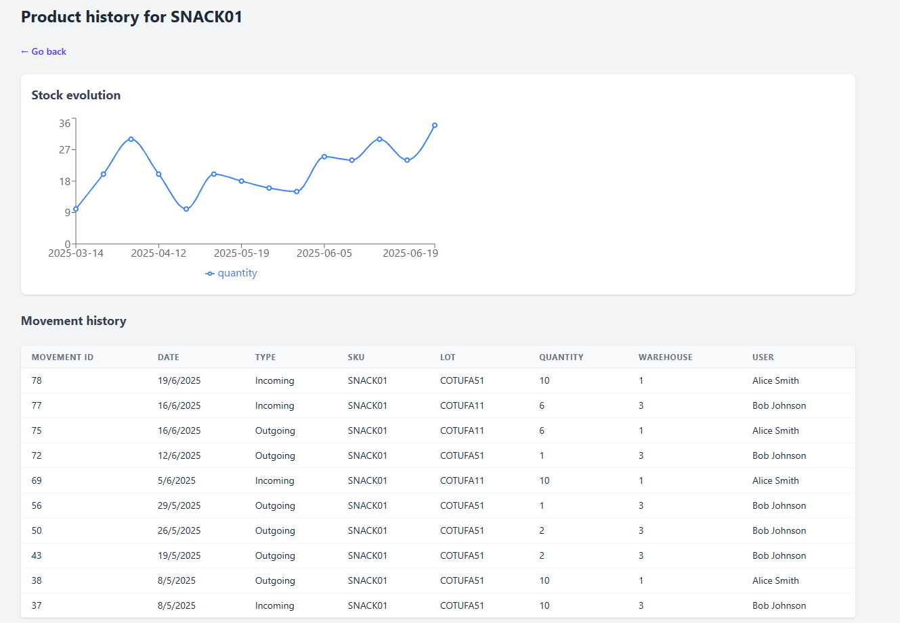

---

> 💡 Tip: Use “View stock” and “View history” actions to access these insights quickly from any product.

## Stock Movements

The **Stock Movements** section tracks every incoming or outgoing transaction in your inventory.

---

### Overview and Quick Access

From the main page, you can:

- Create a new movement
- View the full movement list

This page also includes two summary charts:

- **Movements by Type** – A bar chart comparing the total number of incoming vs. outgoing movements.
- **Monthly Trend** – A line chart showing how stock activity evolved over the last 12 months.

These visuals help monitor patterns like restocking frequency or product demand over time.

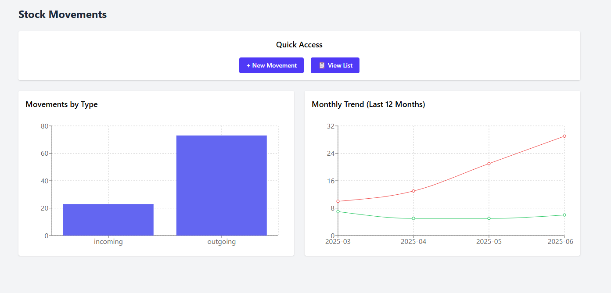

### New Stock Movement

Clicking **+ New Movement** opens a form where you can register incoming or outgoing stock.

You must:

1. Select a **movement type** (`incoming` or `outgoing`)
2. Add one or more **lines**, each including:
   - Warehouse
   - Product
   - Lot (optional, required for outgoing)
   - Expiration date (optional, auto-filled if lot has it)
   - Quantity

**Smart autocomplete**:
- Warehouse and product fields use search-as-you-type (min. 4 characters)
- For **outgoing movements**, selecting a product + warehouse loads available lots

You can:
- Add or remove lines
- Register multiple items in a single movement

Once submitted, the movement is saved and reflected in product stock and history.

### Stock Movements List

The **List** view shows a paginated table of all registered movements.

Each row includes:

- Movement ID
- Type (`incoming` / `outgoing`)
- User who performed it
- Date
- Number of lines
- Action to **View** full detail

You can filter the list by:

- Date range (from / to)
- User
- Movement type
- Search input (by user name)

You can also export the current filtered view to CSV using the **Export CSV** button.

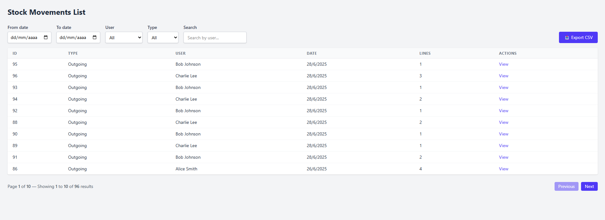

---

### 🔎 Movement Detail

Clicking **View** on any movement opens its detailed breakdown.

This view shows:

- User, type, date, and number of lines
- A table listing each line in the movement:
  - Product name
  - Warehouse
  - Lot (if any)
  - Expiration (if any)
  - Quantity

Useful for audit purposes or confirming stock updates.

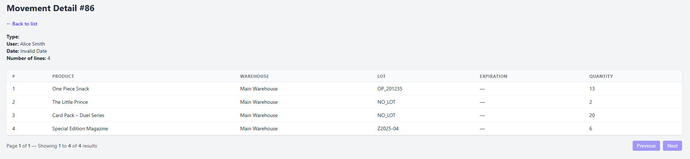

---

> 💡 Tip: Each movement updates the stock in real time and is immediately reflected across product and warehouse views.

## Warehouses

The **Warehouses** section gives you visual insights and quick access to stock data grouped by location.

---

### Overview and Quick Actions

From the main page, you can:

- **Create new warehouse** (admin only)
- **View full warehouse list**

You’ll also see two interactive charts:

1. **Total stock per warehouse** (bar chart)  
   - Shows the total quantity stored in each location  
   - Click on a bar to load the second chart

2. **Products in selected warehouse** (pie chart)  
   - Breaks down the selected warehouse’s stock by product  
   - Click on a product to view its history within that warehouse

This is useful for identifying stock concentration and navigating directly to deeper insights.

---

### Product History in a Warehouse

Clicking a product from the pie chart opens a detailed view:

- Line chart shows how the product’s stock has changed over time in the selected warehouse
- A table below shows the current stock for that product, including lot and expiration if available

Ideal for tracking product lifecycle within a specific warehouse.

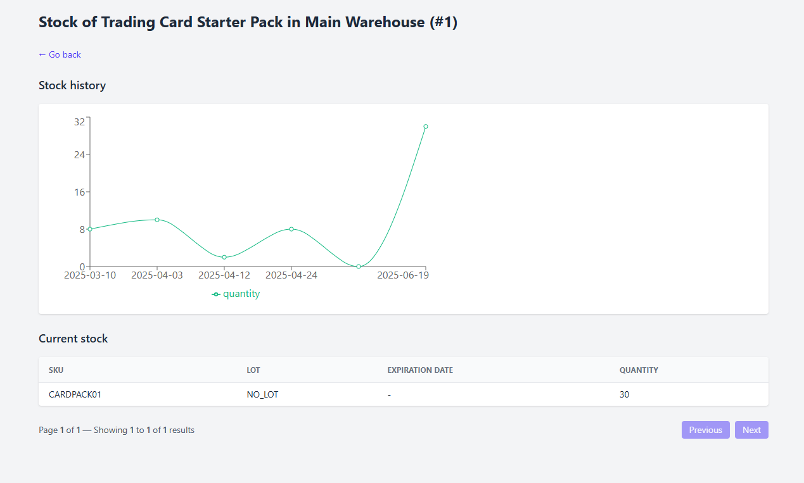

---

### Manage Warehouses

Admins can create, edit, activate or deactivate warehouses from the **Warehouses List**.

---

### Create New Warehouse

From the quick actions or the list view, click **+ New Warehouse** to open a simple form:

- Enter a description (e.g., “North Store”)
- Save to register it

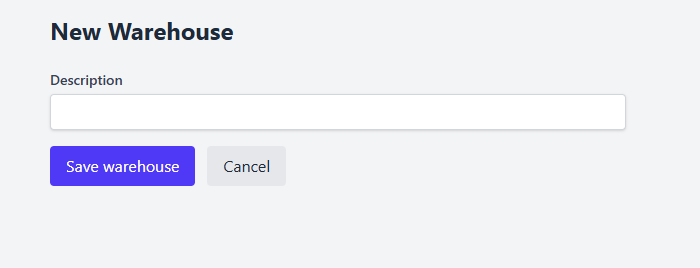

---

### Warehouses List

This list provides a full overview of all warehouses in the system.

You can:

- Filter by description or status (active/inactive)
- Export the list to CSV
- See activation status (in green/red)
- Perform actions:
  - **View** → View details and stats
  - **View stock** → See stock breakdown by product
  - **Edit** → Change description or status
  - **Delete** → Delete the warehouse if empty, inactive and has no associated movements (only admins)

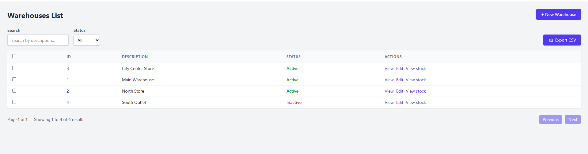

---

### Warehouse Detail & Stock

From the **Warehouses List**, clicking "View" opens the detail page of that warehouse.

- See its ID, description and current status  
- Use the **Edit warehouse** button to change name or toggle active/inactive  

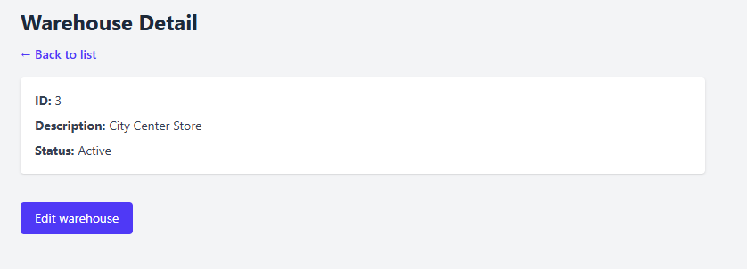

---

### Edit Warehouse

You can:

- Change the warehouse description  
- Activate or deactivate it  
- Cancel or save the changes  

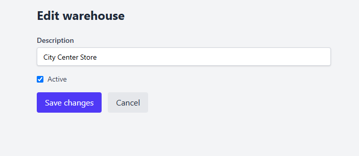

---

### Stock per Warehouse

Clicking “View stock” opens a table with:

- List of products stored in that warehouse  
- Each row includes product name, SKU and quantity  
- Use the **View history** link to see movement history for that product in this warehouse  
- The last row shows the total quantity and allows viewing complete movement history of the warehouse  

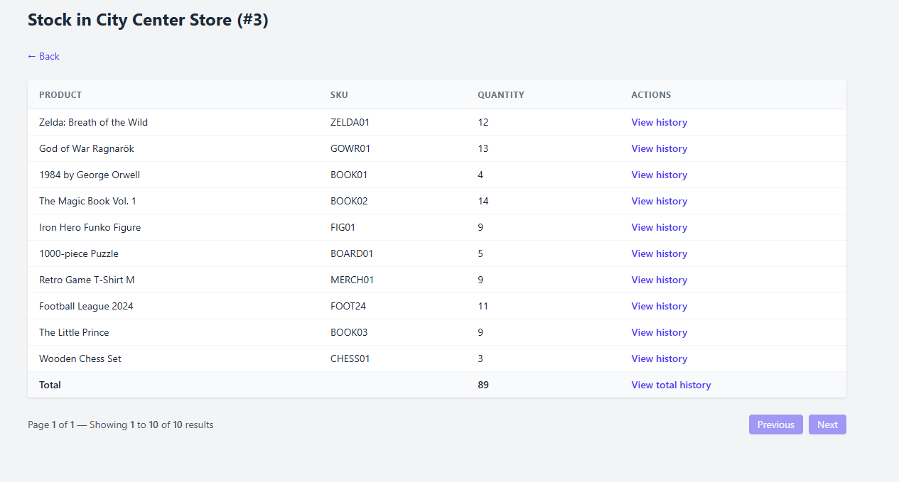

---

## Users (Admin)

User management is available to administrators only. From this section, you can create, edit, activate/deactivate, or delete users. The application starts with three predefined test users, one of them with admin privileges (`alice@example.com`).

---

### Users List

The main screen displays all registered users. You can:

- Search by name or email
- Filter by status (active/inactive)
- Edit or Delete users
- Create a new user
- Export the list to CSV

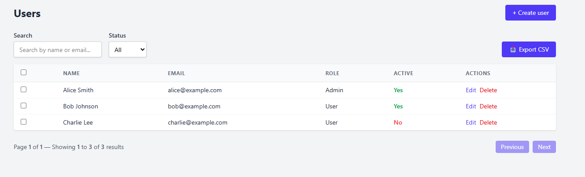

---

### Create User

Clicking **+ Create user** opens a form to register a new user:

- Enter name, email, and password
- Choose a role (`User` or `Admin`)
- Optionally mark the user as active

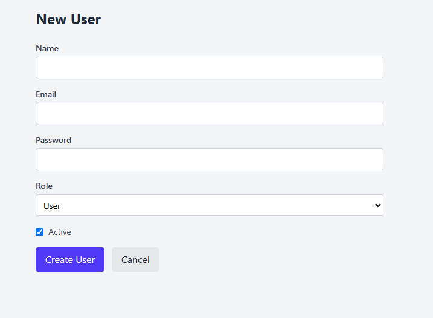

---

### Edit User

Editing a user allows you to:

- Update name, email, or role
- Optionally set a new password
- Activate or deactivate the account
- Delete the user (if no stock movements are associated)

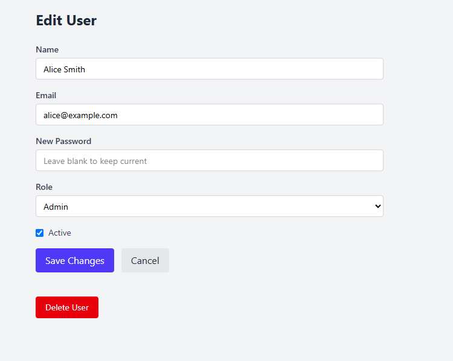

---

## User Profile and Notifications

### Access and Options

Users can access their profile and log out via the dropdown menu in the top-right navbar, next to the notification bell.

- If there are unread notifications, a red indicator appears over the bell icon.
- Clicking on the user name reveals two options:
  - **Your profile**
  - **Log out**

---

### Profile View

On the **Your profile** page, users can see and update their personal information. The role is shown but cannot be changed by the user.

- Fields:
  - Name
  - Email
  - Role (read-only)
- Action:
  - **Edit** button

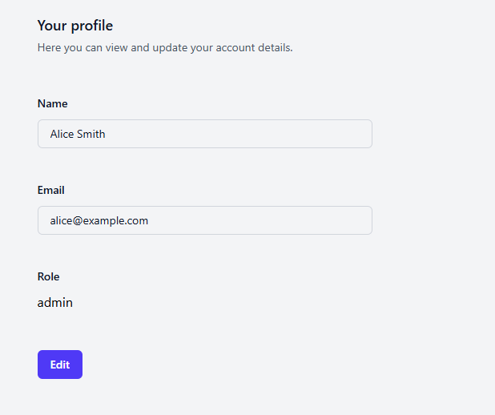

---

### Edit Profile

Users can update their name and email. To confirm changes, they must enter their **current password**.

- Fields:
  - Name
  - Email
  - Password (required to save changes)
- Button:
  - **Save changes**

---

### Real-time Notifications (WebSocket)

The notification bell displays new stock movement alerts in real time via WebSocket.

- If a new stock movement is registered, a notification appears with:
  - ID of the movement
  - Type (incoming/outgoing)
- Each notification can be dismissed individually with ❌
- Clicking on a notification redirects the user to the **Stock Movements List** page.

#### Notification examples:

- **Icon with red badge** (indicating new notification):  
  The red indicator **pulses or blinks** with a soft grow animation to attract attention.

  

- **Notification popup** after clicking the bell:

  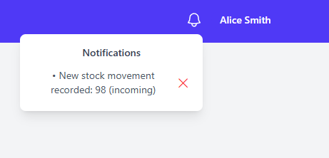
